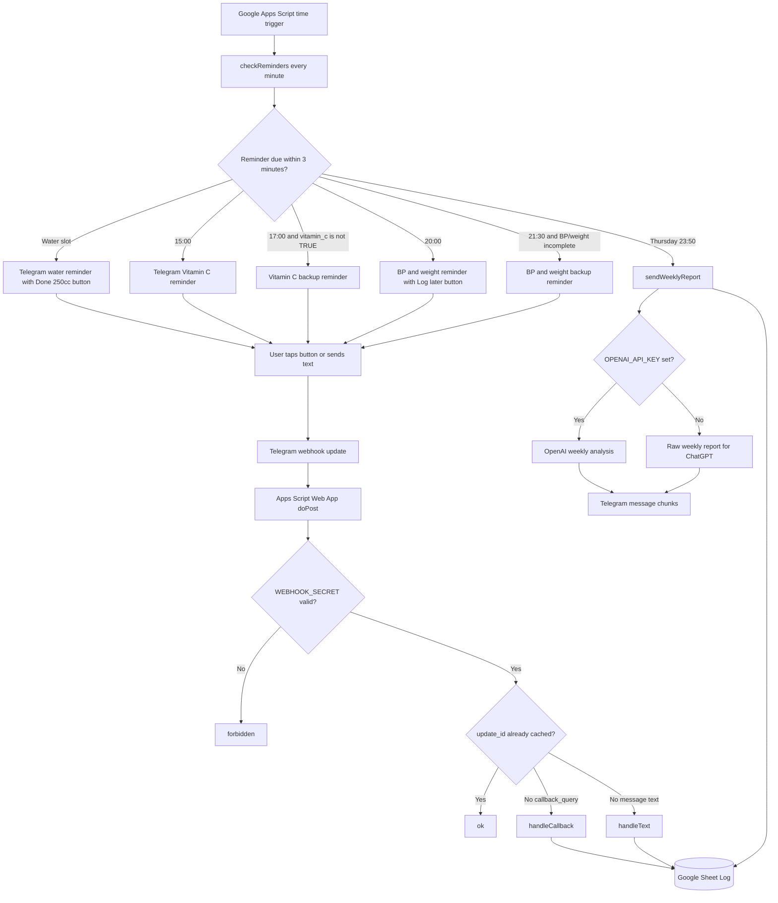

# Drink Reminder Health Tracking System

A cloud-based personal health reminder system built with Google Apps Script, Telegram Bot API, Google Sheets, and an optional OpenAI analysis step.

The goal is simple: keep hydration, Vitamin C, blood pressure, and weight tracking running on a phone-friendly reminder loop without keeping a laptop online. The implementation is intentionally lightweight, but it behaves like a small production workflow: scheduled triggers, webhook callbacks, idempotent button handling, structured storage, weekly reporting, and secret-based configuration.

## Project Overview
This project moves a personal reminder workflow out of manual notes and into a serverless automation stack.

Google Apps Script owns the schedule. Telegram delivers reminders to Android. A Google Sheet stores one health row per calendar day. Inline Telegram buttons log water and Vitamin C. Plain text messages log blood pressure and weight. Backup reminders are skipped when the required data has already been recorded. A weekly report is generated every Thursday night and can either be sent as raw text for manual ChatGPT analysis or passed to OpenAI automatically when an API key is configured.

This was built from the point of view of a senior software engineer moving toward AI engineering, AI agent development, and consultant-style automation work: define the operating loop, keep state explicit, handle retries safely, avoid secret leakage, and make the system easy for a non-specialist user to install.

## Features

- 10 daily water reminders.
- Each water reminder represents `250 cc`.
- Daily water target is `2500 cc`, or `10` cups.
- Water schedule:

```text
07:40
08:45
10:00
11:00
14:00
15:15
16:30
17:45
20:30
21:45
```

- Main Vitamin C reminder at `15:00`.
- Vitamin C backup reminder at `17:00`.
- The `17:00` Vitamin C backup is skipped when today's `vitamin_c` value is already `TRUE`.
- Main blood pressure and weight reminder at `20:00`.
- Blood pressure and weight backup reminder at `21:30`.
- The `21:30` backup is skipped only when today's `bp_sys`, `bp_dia`, and `weight_kg` are all filled.
- Telegram inline button for water: `Done 250cc`.
- Telegram inline button for Vitamin C: `Vitamin C done`.
- Telegram inline button for blood pressure reminder acknowledgement: `Log later`.
- Text parser for blood pressure and weight, recommended public format:

```text
BP 120/80 weight 70
```

- Parser also supports localized keyword forms through the Apps Script regex patterns for `\u8840\u58d3`/`bp` and `\u9ad4\u91cd`/`weight`.
- One Google Sheet tab named `Log`.
- One row per day, keyed by date in `yyyy-MM-dd`.
- Apps Script timezone is `Asia/Taipei`.
- Apps Script trigger checks reminders every minute.
- A reminder is considered due when the current time is at or after the scheduled time and less than 3 minutes late.
- Sent reminders are recorded in Script Properties as `sent:YYYY-MM-DD:<key>` so the same reminder is not resent repeatedly.
- Telegram webhook accepts `message` and `callback_query` updates.
- Telegram webhook can be protected by a `WEBHOOK_SECRET` query parameter.
- Telegram duplicate update protection uses Apps Script CacheService with keys like `update:<update_id>` for `21600` seconds.
- Weekly report is sent every Thursday night at approximately `23:50`.
- Weekly report covers the current day plus the previous 6 days.
- Weekly report includes daily water, Vitamin C, blood pressure, weight, target completion counts, average water, average blood pressure, and average weight.
- Optional OpenAI API integration uses the Responses API and can return a concise, non-diagnostic Traditional Chinese analysis.
- If OpenAI is not configured, the raw weekly report is sent to Telegram with instructions to paste it into ChatGPT manually.
- Telegram messages are chunked at `3500` characters for long reports.
- Duplicate water and Vitamin C callbacks reply with `Already logged` and do not write duplicate records.
- Telegram API failures raise or log useful errors depending on whether the operation is critical.

## Tech Stack

| Layer | Technology | Responsibility |
| --- | --- | --- |
| Scheduler | Google Apps Script time triggers | Runs minute-level reminder checks and weekly reporting |
| Webhook | Google Apps Script Web App | Receives Telegram messages and callback queries |
| Notification UI | Telegram Bot API | Sends reminders, inline buttons, callback popups, and chat confirmations |
| Storage | Google Sheets | Stores one structured row per day |
| Secrets/config | Apps Script Script Properties | Stores bot token, chat ID, sheet ID, webhook secret, web app URL, and optional OpenAI settings |
| Optional AI path | OpenAI Responses API | Summarizes weekly health data when `OPENAI_API_KEY` exists |

## Architecture



## Folder Structure

```text
.
├── README.md
├── SETUP.md
├── apps-script
│   └── Code.gs
└── docs
    ├── content-pack.md
    └── google-sheet-schema.md
```

| File | Purpose |
| --- | --- |
| `README.md` | Public engineer README and operating guide |
| `SETUP.md` | Step-by-step setup guide for first-time users |
| `apps-script/Code.gs` | Main Google Apps Script source code |
| `docs/google-sheet-schema.md` | Google Sheet schema reference |
| `docs/content-pack.md` | Resume, LinkedIn, commit, PR, and consultant-positioning content |

## Installation

### Requirements

You need:

- a Google account
- a Telegram account
- a Google Sheet
- a Google Apps Script project
- the full `apps-script/Code.gs` file from this repository
- about 30 to 60 minutes for setup and testing

### 1. Create the Google Sheet

1. Open Google Sheets.
2. Create a new spreadsheet.
3. Recommended spreadsheet name:

```text
Health Reminder Log
```

4. Rename the first sheet tab to:

```text
Log
```

5. Add this header row in row 1:

```text
date
water_ml
water_cups
vitamin_c
vitamin_time
bp_sys
bp_dia
weight_kg
bp_weight_time
last_water_time
water_0740
water_0845
water_1000
water_1100
water_1400
water_1515
water_1630
water_1745
water_2030
water_2145
notes
updated_at
```

6. Copy the Spreadsheet ID from the URL:

```text
https://docs.google.com/spreadsheets/d/SPREADSHEET_ID/edit
```

The value between `/d/` and `/edit` becomes the `SPREADSHEET_ID` Script Property.

### 2. Understand the Sheet Schema

The script expects one tab named `Log`.

Each row represents one calendar day in the configured timezone. The date key format is `yyyy-MM-dd`.

| Column | Purpose |
| --- | --- |
| `date` | Daily record key, formatted as `yyyy-MM-dd` |
| `water_ml` | Total water amount for the day |
| `water_cups` | Number of completed 250 cc cups |
| `vitamin_c` | `TRUE` when Vitamin C has been logged |
| `vitamin_time` | Time when Vitamin C was logged |
| `bp_sys` | Systolic blood pressure |
| `bp_dia` | Diastolic blood pressure |
| `weight_kg` | Body weight in kilograms |
| `bp_weight_time` | Time when blood pressure and weight were logged |
| `last_water_time` | Time of the most recent water log |
| `water_0740` to `water_2145` | One boolean slot per water reminder |
| `notes` | Optional notes |
| `updated_at` | Last update timestamp |

When a new daily row is created, the script writes these formulas automatically:

```text
water_ml = water_cups * 250
water_cups = COUNTIF(water slots, TRUE)
```

In the current sheet layout, `water_ml` is set with `=C<row>*250`, and `water_cups` is set with `=COUNTIF(K<row>:T<row>,TRUE)`.

Do not store secrets in Google Sheets. Use Apps Script Script Properties for Telegram tokens, chat IDs, webhook secrets, OpenAI API keys, and OAuth-related values.

### 3. Create a Telegram Bot

1. Open Telegram.
2. Search for the official bot:

```text
@BotFather
```

3. Send:

```text
/newbot
```

4. Provide a display name, for example:

```text
Drink Reminder
```

5. Provide a username ending with `bot`, for example:

```text
YourDrinkReminder_bot
```

6. BotFather returns a token. Store it as:

```text
TELEGRAM_BOT_TOKEN
```

Never publish this token. If it leaks, use BotFather `/revoke`, select the bot, generate a new token, and update the `TELEGRAM_BOT_TOKEN` Script Property.

### 4. Get the Telegram Chat ID

1. Open the new Telegram bot.
2. Send:

```text
Hello
```

3. Open this URL in a browser:

```text
https://api.telegram.org/bot<TELEGRAM_BOT_TOKEN>/getUpdates
```

The word `bot` must appear before the token.

4. Find `chat.id` in the JSON response:

```json
{
  "ok": true,
  "result": [
    {
      "message": {
        "chat": {
          "id": 123456789
        },
        "text": "Hello"
      }
    }
  ]
}
```

The number in `chat.id` becomes:

```text
TELEGRAM_CHAT_ID
```

If the response is:

```json
{"ok":true,"result":[]}
```

the bot has not received a message yet. Send `Hello` to the bot and refresh the URL.

### 5. Create the Apps Script Project

1. Open Google Apps Script.
2. Create a new project.
3. Recommended project name:

```text
Drink_Reminder
```

4. Open `Editor`.
5. Open `Code.gs`.
6. Delete the default content.
7. Paste the full content of `apps-script/Code.gs`.
8. Save.

If syntax errors appear, confirm that the whole file was pasted.

### 6. Configure Script Properties

Script Properties are project-level key-value settings inside Apps Script. They are not Google Sheet cells and are not part of `Code.gs`.

Open Apps Script `Project Settings`, scroll to `Script Properties`, and add the required properties.

Required before testing Telegram delivery:

| Property | Value | Where to get it |
| --- | --- | --- |
| `SPREADSHEET_ID` | Your Google Sheet ID | The value between `/d/` and `/edit` in the Sheet URL |
| `TELEGRAM_BOT_TOKEN` | Your Telegram bot token | BotFather |
| `TELEGRAM_CHAT_ID` | Your Telegram chat ID | `chat.id` from `getUpdates` |
| `WEBHOOK_SECRET` | A private random string | You choose it, for example `my-health-secret-2026` |

Required after Web App deployment:

| Property | Value | Where to get it |
| --- | --- | --- |
| `WEB_APP_URL` | Apps Script Web App URL | Generated after Web App deployment |

Optional:

| Property | When to use it |
| --- | --- |
| `OPENAI_API_KEY` | Enables automatic OpenAI weekly analysis |
| `OPENAI_MODEL` | Overrides the default OpenAI model |

If `OPENAI_API_KEY` is not set, the system still works. Telegram receives the raw weekly report and you can paste it into ChatGPT manually. If `OPENAI_MODEL` is not set, the script defaults to the documented API model ID `gpt-5-mini`.

### 7. Test Telegram Delivery

Before setting the webhook, confirm Apps Script can send a Telegram message.

1. In Apps Script `Editor`, select the function:

```text
sendTestMessage
```

2. Click `Run`.
3. Approve Google authorization on the first run.
4. Telegram should receive:

```text
Health reminder system test succeeded.
```

If this fails, common causes are an incorrect `TELEGRAM_BOT_TOKEN`, leading/trailing token spaces, an incorrect `TELEGRAM_CHAT_ID`, or no chat having been started with the bot.

### 8. Deploy Apps Script as a Web App

1. Click `Deploy`.
2. Select `New deployment`.
3. Select deployment type `Web app`.
4. Recommended description:

```text
v1 initial web app deployment
```

5. Set `Execute as` to:

```text
Me
```

6. Set `Who has access` to:

```text
Anyone
```

7. Click `Deploy`.
8. Copy the Web App URL. It should look like:

```text
https://script.google.com/macros/s/<DEPLOYMENT_ID>/exec
```

9. Add the URL to Script Properties:

```text
WEB_APP_URL = your Web App URL
```

The URL should usually end with `/exec`.

### 9. Set the Telegram Webhook

1. In the Apps Script function dropdown, select:

```text
setTelegramWebhook
```

2. Click `Run`.
3. The execution log should show:

```json
{"ok":true,"result":true,"description":"Webhook was set"}
```

The script calls `https://api.telegram.org/bot<TOKEN>/setWebhook` with:

- `url` set to `WEB_APP_URL` plus `?secret=<WEBHOOK_SECRET>` when a secret exists
- `allowed_updates` set to `["message", "callback_query"]`
- `drop_pending_updates` set to `true`

### 10. Create Reminder Triggers

Run this Apps Script function:

```text
setupTrigger
```

It deletes existing project triggers for `checkReminders` and `sendWeeklyReport`, then creates:

- `checkReminders`: time-based trigger running every minute
- `sendWeeklyReport`: weekly trigger on Thursday at hour `23`, near minute `50`, every week

The reminder checker itself also calls `sendWeeklyReport()` when it is Thursday and `23:50`, while `sendWeeklyReport()` uses `sent:YYYY-MM-DD:weekly_report` to avoid duplicate weekly sends.

## Usage

### Water Logging

At each scheduled water time, Telegram sends:

```text
Water reminder <time>
Please drink 250 cc.
```

The message includes this inline button:

```text
Done 250cc
```

The callback data is:

```text
water:<index>
```

When tapped, the script sets the corresponding water slot column to `TRUE`, updates `last_water_time`, updates `updated_at`, answers the callback popup, and sends a chat confirmation:

```text
Logged: 15:15 water 250 cc.
```

If the same old water button is tapped again, the script checks whether the slot is already `TRUE`, does not increment the water count again, and replies:

```text
Already logged: 15:15 water 250 cc.
```

The callback popup says:

```text
15:15 water was already logged.
```

### Vitamin C Logging

At `15:00`, Telegram sends:

```text
15:00 Vitamin C reminder.
Tap the button after taking it.
```

The message includes:

```text
Vitamin C done
```

The supported callback data values are:

```text
vitamin:done
vitamin_done
vitamin
```

When tapped for the first time that day, the script sets `vitamin_c` to `TRUE`, writes `vitamin_time`, updates `updated_at`, answers the callback popup with `Logged Vitamin C.`, and sends:

```text
Logged: Vitamin C done. The 17:00 backup reminder will be skipped.
```

If an old Vitamin C button is tapped again, no duplicate record is written. The callback popup says `Vitamin C was already logged.`, and the chat receives:

```text
Already logged: Vitamin C done. The 17:00 backup reminder will be skipped.
```

At `17:00`, the backup reminder sends only if `vitamin_c` is not already `TRUE`:

```text
Backup reminder: Vitamin C has not been logged yet.
```

### Blood Pressure and Weight Logging

At `20:00`, Telegram sends:

```text
20:00 Blood pressure and weight reminder.
Reply like: BP 128/82 weight 72.4
```

The message includes:

```text
Log later
```

The callback data is:

```text
bp:later
```

Tapping it only answers the callback:

```text
OK. I will remind again at 21:30 if BP and weight are not logged.
```

To log values, send:

```text
BP 120/80 weight 70
```

The parser accepts 2- or 3-digit systolic and diastolic values and a 2- or 3-digit weight with an optional decimal. It supports both `bp`/`weight` and localized keyword alternatives represented in the source as `\u8840\u58d3` and `\u9ad4\u91cd`.

On success, the script writes `bp_sys`, `bp_dia`, `weight_kg`, `bp_weight_time`, and `updated_at`, then replies:

```text
Logged: BP 120/80, weight 70 kg. The 21:30 backup reminder will be skipped.
```

If text cannot be parsed, Telegram receives:

```text
Received but not parsed: <original text>
Use: BP 120/80 weight 70
```

At `21:30`, the backup reminder sends only if at least one of `bp_sys`, `bp_dia`, or `weight_kg` is missing:

```text
Backup reminder: blood pressure and weight are not fully logged yet.
Reply like: BP 128/82 weight 72.4
```

### Weekly Summary

The weekly report runs Thursday night at approximately `23:50`.

It collects rows from the last 7 calendar days, sorted by date, and builds a report with:

- report date range
- targets: `water 2500 ml/day`, `Vitamin C daily`, `BP+weight daily`
- daily rows showing water ml, cup count out of 10, Vitamin C yes/no, BP value or missing, and weight value or missing
- water average in ml/day
- number of days water target was met
- number of Vitamin C completion days
- number of BP+weight completion days
- average BP when BP data exists
- average weight when weight data exists
- a non-diagnostic prompt asking for trends, adherence, missing data, practical next-week suggestions, and clinician consultation guidance for concerning readings

Without `OPENAI_API_KEY`, Telegram receives:

```text
Weekly health summary for ChatGPT

Copy the block below into ChatGPT for analysis:

<raw weekly report>
```

With `OPENAI_API_KEY`, the script calls:

```text
https://api.openai.com/v1/responses
```

It sends:

- `model`: `OPENAI_MODEL` or default `gpt-5-mini`
- `input`: a prompt asking for concise, non-diagnostic feedback in Traditional Chinese
- `max_output_tokens`: `1200`

If the OpenAI API call fails, Telegram receives an error wrapper with the HTTP status and the raw weekly summary. If OpenAI returns no text, Telegram receives a fallback message plus the report. If analysis succeeds, Telegram receives:

```text
Weekly ChatGPT analysis

<analysis>

Raw data:
<raw weekly report>
```

## Apps Script Behavior Notes

- `doPost(e)` returns `forbidden` when `WEBHOOK_SECRET` exists and the incoming `secret` query parameter does not match.
- Valid webhook requests parse `e.postData.contents` as Telegram JSON.
- Duplicate `update_id` values are skipped using CacheService for 6 hours.
- `handleCallback_()` processes Telegram button taps.
- `handleText_()` processes BP and weight messages.
- `sendTelegramMessage_()` sends to the configured `TELEGRAM_CHAT_ID`.
- `sendTelegramMessageToChat_()` can reply to the callback message chat ID.
- `answerCallbackQuery_()` shows Telegram callback popups and logs API failures instead of throwing.
- `safeNotifyAdmin_()` tries to send an admin notification when `doPost` catches an error.
- `getOrCreateDateRow_()` finds today's row or creates one with water formulas.
- `getLogSheet_()` opens the spreadsheet by `SPREADSHEET_ID` and expects the sheet name `Log`.
- `startOfDay_()` uses an explicit `+08:00` day boundary aligned with `Asia/Taipei`.

## Result

The finished system gives a personal health workflow the properties of a reliable automation:

- reminders run in the cloud even when the computer is off
- Telegram becomes the Android-friendly interaction surface
- data is stored in a simple spreadsheet that can be reviewed or exported
- old buttons are safe to tap because duplicate callbacks do not double-count water or Vitamin C
- backup reminders are conditional instead of noisy
- weekly summaries are structured enough for ChatGPT or OpenAI analysis
- setup is reproducible because all runtime configuration is in Script Properties

## Troubleshooting

### `getUpdates` returns an empty result

If this appears:

```json
{"ok":true,"result":[]}
```

the bot has not received a message yet. Open Telegram, send `Hello` to the bot, and refresh the URL.

### Telegram API returns `404 Not Found`

Common causes:

- the URL is missing the word `bot`
- the token is wrong
- the token was revoked
- the token has leading or trailing spaces

Correct:

```text
https://api.telegram.org/bot<TELEGRAM_BOT_TOKEN>/getUpdates
```

Wrong:

```text
https://api.telegram.org/<TELEGRAM_BOT_TOKEN>/getUpdates
```

### `sendTestMessage` works, but Telegram replies do nothing

Check this order:

1. Confirm the Web App was deployed.
2. Confirm `WEB_APP_URL` exists in Script Properties.
3. Confirm the URL ends with `/exec`.
4. Run `setTelegramWebhook`.
5. Confirm the log says `Webhook was set`.
6. Send `BP 120/80 weight 70`.
7. Open Apps Script `Executions`.
8. Confirm `doPost` ran.
9. Confirm `WEBHOOK_SECRET` matches the webhook URL.
10. Confirm the active deployment is the newest deployed version.

### Vitamin C button looks like it does nothing

The current behavior sends a normal chat message when Vitamin C is already logged:

```text
Already logged: Vitamin C done. The 17:00 backup reminder will be skipped.
```

If there is no reply at all:

1. Confirm the active deployment is the latest version.
2. Confirm `doPost` appears in Apps Script `Executions`.
3. Run `setTelegramWebhook` again.

### Water button replies many times

Possible causes:

- Telegram resent the callback.
- The user tapped the same old button multiple times.
- An older deployment did not check whether that water slot was already logged.

The current code checks whether the matching water cell is already `TRUE`. If it is already logged, it sends:

```text
Already logged: 15:15 water 250 cc.
```

It does not increase the water count again.

### Fewer than 10 `sent:YYYY-MM-DD:water_*` properties appear

That is normal. `sent:*` Script Properties are not a complete daily checklist. They only record reminders that have already been sent. There are 10 water reminder times, but only the times that have already occurred today will appear as `sent:*` keys.

### Backup reminders still fire

The `17:00` Vitamin C backup is skipped only when `vitamin_c` is `TRUE`.

The `21:30` blood pressure and weight backup is skipped only when all three fields are filled:

```text
bp_sys
bp_dia
weight_kg
```

## Deployment Rule

In Google Apps Script, saving `Code.gs` is not the same as updating the active Web App deployment.

After changing code:

1. Save `Code.gs`.
2. Click `Deploy`.
3. Click `Manage deployments`.
4. Select the active Web App deployment.
5. Click the pencil icon.
6. Set `Version` to `New version`.
7. Add a clear deployment description.
8. Click `Deploy`.

If you skip this, Telegram continues calling the old deployed version.

Recommended deployment descriptions:

```text
v1 initial web app deployment
v2 fix webhook setup
v3 fix BP and weight parsing
v4 add duplicate callback protection
v5 add weekly report
v6 stable reminders and Telegram logging
v7 fix Vitamin C callback responses
v8 make callback popup non-blocking
v9 chat-confirm already logged callbacks
```

## Security

Never commit real secrets to GitHub, Medium, screenshots, public docs, or group chats:

- Telegram bot token
- Telegram chat ID
- Apps Script Web App URL if it contains a secret
- `WEBHOOK_SECRET`
- OpenAI API key
- Google OAuth credentials
- private Web App URLs containing secrets

Use placeholders in public documentation:

```text
<TELEGRAM_BOT_TOKEN>
<TELEGRAM_CHAT_ID>
<WEBHOOK_SECRET>
<WEB_APP_URL>
<SPREADSHEET_ID>
```

## Final Verification Checklist

- [ ] Google Sheet has a `Log` sheet.
- [ ] The `Log` header row is complete.
- [ ] Apps Script `Code.gs` has been fully pasted.
- [ ] Script Properties include `SPREADSHEET_ID`.
- [ ] Script Properties include `TELEGRAM_BOT_TOKEN`.
- [ ] Script Properties include `TELEGRAM_CHAT_ID`.
- [ ] Script Properties include `WEBHOOK_SECRET`.
- [ ] `sendTestMessage` sends a Telegram message.
- [ ] The Web App has been deployed.
- [ ] Script Properties include `WEB_APP_URL`.
- [ ] `setTelegramWebhook` logs `Webhook was set`.
- [ ] `setupTrigger` has been run.
- [ ] The Triggers page includes `checkReminders`.
- [ ] The Triggers page includes `sendWeeklyReport`.
- [ ] Sending `BP 120/80 weight 70` writes to Google Sheets.
- [ ] A water button writes to Google Sheets.
- [ ] The Vitamin C button writes to Google Sheets.
- [ ] Tapping an old button replies with `Already logged` and does not duplicate the record.

## Related Publication

- [Building a Phone-First Health Reminder System](https://medium.com/@seek1andfind2/building-a-phone-first-health-reminder-system-e4b415e71db5)

## Lessons Learned

- Scheduled personal automation needs state, not just reminders.
- Telegram inline callbacks are convenient, but duplicate callback handling is required for safe logging.
- Apps Script deployments are versioned; editing source code does not update the webhook target by itself.
- Script Properties are the right place for secrets and runtime configuration.
- Google Sheets works well as an auditable, low-friction database when the schema is fixed and simple.
- Weekly AI analysis is more useful when the raw report is deterministic and non-diagnostic boundaries are explicit.

## Future Improvements

- Add a setup validator function that checks Script Properties, sheet name, headers, and trigger installation.
- Add a command such as `/today` to return the current day's completion state.
- Add a command such as `/week` to send the weekly report on demand.
- Add configurable reminder schedules without editing source code.
- Add more health metrics while keeping one row per day.
- Add anomaly flags for missing data and unusually high or low readings without making medical diagnoses.
- Add an AI agent layer that can explain adherence patterns, ask follow-up questions, and prepare consultant-style weekly recommendations.
- Package the workflow as a reusable template for AI automation consulting projects.

## License

Use and adapt this project for your own personal automation workflow.
